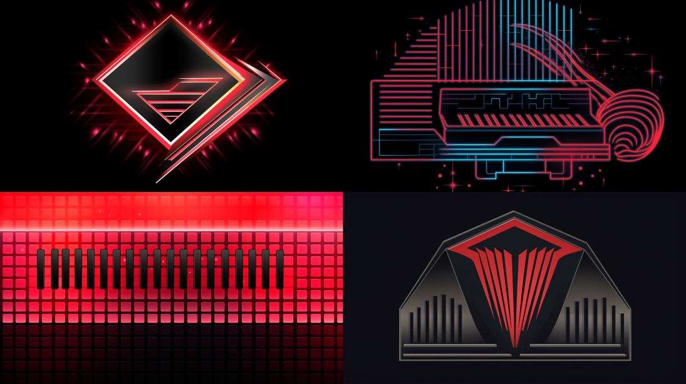

# Midjourney Prompt Generator

This project is a prompt generator that generates random prompts for [Midjourney](https://midjourney.com). The prompts are generated based on a YAML file containing options for different design elements.

## Usage
```
python3 midijourney_prompt_generator.py
```
Modify input.yaml to suit your needs, then 20 random prompts will be printed to the console and saved in `output.txt` with a timestamp.

## Customization

To customize the design options, modify the `input.yaml` file. The YAML file has the following structure:

- `command`: The blueprint for the prompt command. Modify this to suit your specific requirements.
- `style`: A list of different styles.
- `symbol`: A list of different symbols.
- `color`: A list of common design colors.
- `background`: A list of common background colors or gradients.
- `additional_element`: A list of additional design elements.

Modify the options under each category to match your desired choices.

## Example

Here is an example of a generated prompt:

```
Design of futuristic logo featuring a piano keyboard in red on a blackish gradient background. Include pattern as an additional design element. --v 5 --ar 16:9 --c 20 --q 1
```
[](./example.png)

In this example, the script randomly selected the "futuristic" style, "piano keyboard" symbol, "red" color, "blackish gradient" background, and "pattern" as the additional design element.

The additional options `--v 5 --ar 16:9 --c 100 --q 1` are added to the end of the command for additional configuration. These options are not generated randomly and are the same for all prompts. 
- The `--ar` option is to set the desired [aspect ratio](https://docs.midjourney.com/docs/aspect-ratios).
- The `--c` option is for [chaos](https://docs.midjourney.com/docs/chaos) and is used to set how much variation there is. 
- The `--q` option is to set the [quality](https://docs.midjourney.com/docs/quality) of the generated images (`0.25`, `0.5`, or `1`). Higher values use more of your subscription's GPU minutes and take longer to render.

## Output

The generated prompts will be saved in the `output.txt` file with an appended timestamp so you can save all your previous prompts. Each prompt will be listed on a separate line in the file.


## Contributing

If you find any bugs or want to suggest new features, please feel free to contribute by submitting an [issue](https://github.com/itsbrex/midjourney-prompt-generator/issues) or a [pull request](https://github.com/itsbrex/midjourney-prompt-generator/pulls).

## Contributors ✨
Thanks goes to these wonderful people ([emoji key](https://github.com/all-contributors/all-contributors#emoji-key)):

<!-- ALL-CONTRIBUTORS-BADGE:START - Do not remove or modify this section -->
[](#Contributing)

<!-- ALL-CONTRIBUTORS-BADGE:END -->

<!-- ALL-CONTRIBUTORS-LIST:START - Do not remove or modify this section -->
<!-- prettier-ignore-start -->
<!-- markdownlint-disable -->

<!-- markdownlint-restore -->
<!-- prettier-ignore-end -->

<!-- ALL-CONTRIBUTORS-LIST:END -->
This project follows the [all-contributors](https://allcontributors.org/) specification. Contributions of any kind welcome!

## License

Licensed under the MIT license. See the [LICENSE](./LICENSE) file for more information.

If you found this project interesting or helpful, please consider [sponsoring me](https://github.com/sponsors/itsbrex) or <a href="https://twitter.com/itsbrex">following me on twitter </a>